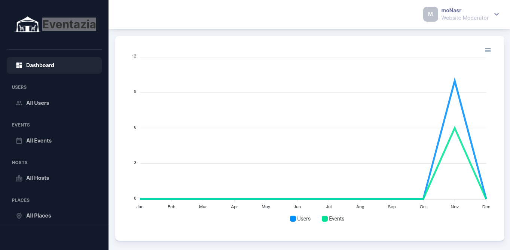
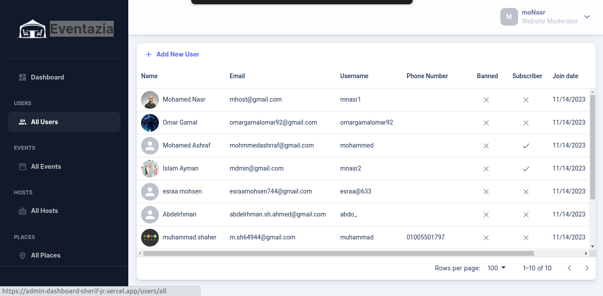
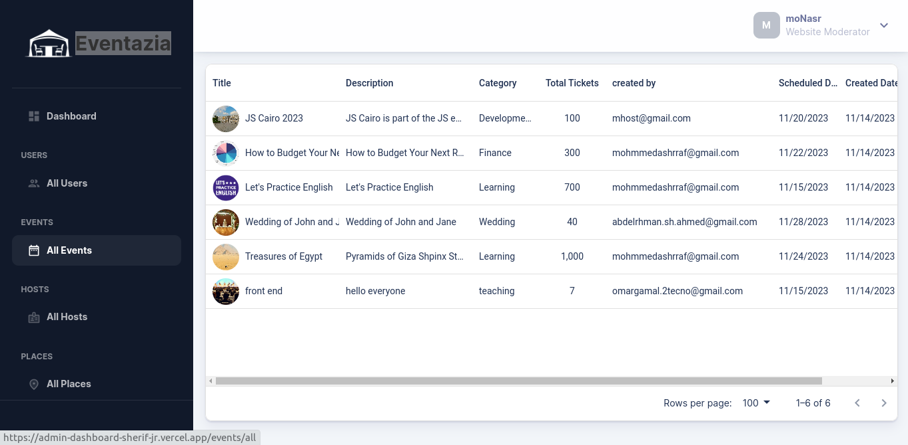
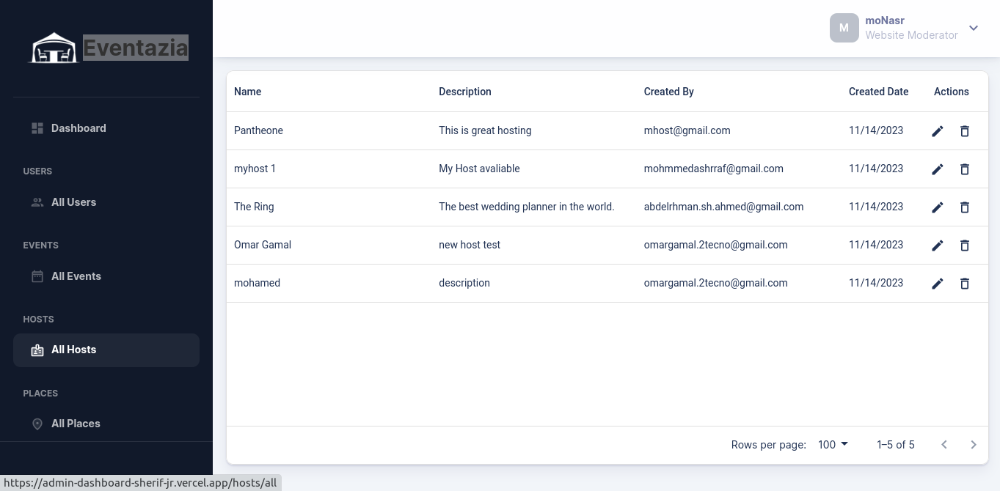
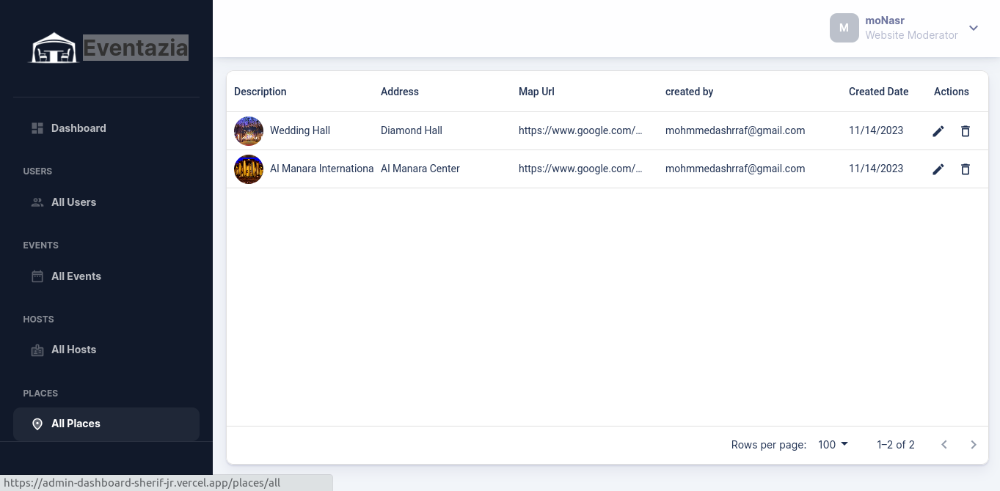

# Eventazia

An admin dashboard for a website that can serve all users who need to organize or attend events.

## Taple of contents

- [Eventazia](#eventazia)
  - [Taple of contents](#taple-of-contents)
  - [Overview](#overview)
    - [Features](#features)
    - [Screenshot](#screenshot)
    - [Links](#links)
  - [Processes](#processes)
    - [Built with](#built-with)
    - [Installation](#installation)
  - [Author](#author)

## Overview

This is the graduation project of Intensive Code Camp(ICC) - Full Stack using MERN - IT Institute

### Features

- Separate admin dashboard for main website with:
  - Full control over the website’s data to ensure that operations are facilitated for the user
  - Statistical chart of all website data
  - Ensure the privacy of user data and assist in retrieving it

### Screenshot

- 
- 
- 
- 
- 

### Links

- [GitHub URL](https://github.com/Sherif-jr/admin-dashboard)
- [Live URL](https://admin-dashboard-sherif-jr.vercel.app/)

## Processes

- Brainstorming & Data Collection
- Website colors & Design
- Front end & Back end development cycle
- Testing
- Deployment

### Built with

- React
- Material UI
- emotion/react
- tanstack/react-query
- apexcharts
- formik
- jwt-decode
- react-toastify
- formik
- yup

### Installation

```shell
# Example commands
git clone https://github.com/Sherif-jr/admin-dashboard.git
cd admin-dashboard
npm install
npm run dev
```

## Author

- [Mohamed Ashraf](https://www.linkedin.com/in/mohamedashrraf/)
- [Abdelrhman Sherif](https://www.linkedin.com/in/abdelrhman-sherif/)
- [Esraa Mohsen](https://www.linkedin.com/in/esraa-mohsen-356687233/)
- [Muhammad Al-kilany](https://www.linkedin.com/in/muhammadalkilany/)
- [Omar Gamal](https://www.linkedin.com/in/omar-gamal-98ab57219/)
- [Mohamed Nasr](https://www.linkedin.com/in/mhmdnsr-dev)
